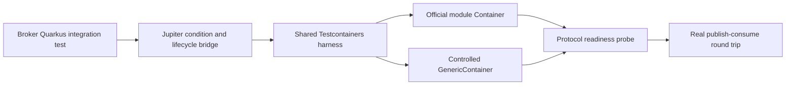
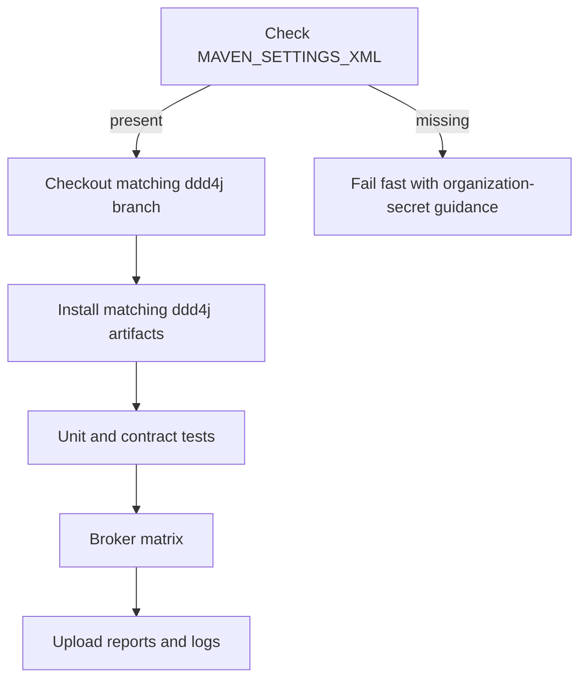

# P4 — 双分支 Testcontainers 2.0.5 与 Maven 4 收敛设计

- 日期: 2026-09-07
- 作者: ddd-4-java
- 状态: 进行中（Testcontainers 实施；Maven 4 subprojects 暂缓）
- 范围: ddd4j-quarkus feature/3.3.x、feature/4.0.x
- 涉及模块: 根聚合 POM、ddd4j-quarkus-dependencies、ddd4j-quarkus-mq-testcontainers、13 个 MQ 适配模块、CI 与能力对齐文档
- 规格事实源: 本文档

## 1. 背景与现状

ddd4j-quarkus 已完成 P0-P3 编码，但当前验证证据与源码状态不再完全一致：

- feature/3.3.x 对齐 ddd4j feature/2.0.x，Java 17、Maven 3、Quarkus BOM 3.37.4。
- feature/4.0.x 对齐 ddd4j feature/3.0.x，Java 21、Maven 4、Quarkus 3.38.2。2026-09-07 已按用户授权验证 Quarkus main `999-SNAPSHOT`，但 nightly 仍不能解析 Maven 4 `subprojects`，因此当前可执行基线保留 3.38.2 + `modules`。
- 变更前两条线均使用 Testcontainers 1.20.4 和自定义 GenericContainer fixture；feature/4.0.x 已完成 2.0.5 迁移，feature/3.3.x 待移植。
- RocketMQ、Pulsar 的整个 round-trip 测试类被 Disabled，不能作为真实集成验证。
- ONS、MQTT-Mica 存在按环境或商业协议有意禁用的 round-trip。
- 旧 P2 文档仍声称全部 broker 真实运行通过，需要按新的验证结果纠正。
- feature/4.0.x 已采用 modelVersion 4.1.0；六个聚合 POM 暂时保留 Maven 4 兼容的 modules/module，等待 Quarkus WorkspaceLoader 支持 subprojects。
- GitHub Actions 必须通过 ddd-4-java 组织级 MAVEN_SETTINGS_XML 注入 Maven settings。

## 2. 目标

1. 两条分支统一升级到 Testcontainers 2.0.5。
2. 官方提供 Java 专用模块的 broker 使用官方 Container 类型。
3. 无官方专用 Java 模块的 broker 继续使用边界清晰的 GenericContainer。
4. 恢复 RocketMQ、Pulsar 的真实 publish-consume round-trip，并消除仅靠 Disabled 获得绿灯的情况。
5. 明确公开镜像验证、商业协议验证和平台限制验证三类证据。
6. feature/4.0.x 最终全部 Maven 4 聚合 POM 使用 subprojects/subproject；在 quarkusio/quarkus#52190 完成前，该目标暂停且不作为本轮 Testcontainers 交付的完成门禁。
7. 双分支分别使用正确的 ddd4j、Quarkus、JDK、Maven 与 CI 安装链；4.0.x 的 nightly 必须通过官方每日 snapshot 安装流程获得。
8. 更新 P2、能力矩阵与 README，使文档只陈述本轮实际验证过的结论。

## 3. 非目标

- feature/3.3.x 不升级 Quarkus 3.37.4。
- feature/4.0.x 仅临时使用 Quarkus main `999-SNAPSHOT` 做前瞻验证，不把 nightly 写入项目或作为生产发布、稳定兼容承诺。
- 不升级 ddd4j 的发布版本线。
- 不实现 ONS、TDMQ 云厂商真实账号测试。
- 不把 Quarkus Dev Services 引入为第二套测试编排体系。
- 不修改 ddd4j-boot 的生产代码。
- 不创建 Git worktree。
- 不处理与本变更无关的 auth、sample 或业务功能。

## 4. 双分支基线

| ddd4j-quarkus 分支 | ddd4j 分支 | ddd4j-quarkus 版本 | Quarkus BOM | Java | Maven 模型 | 聚合标签 |
|---|---|---|---|---|---|---|
| feature/3.3.x | feature/2.0.x | 3.3.x.20260630-SNAPSHOT | 3.37.4 | 17 | 4.0.0 | modules/module |
| feature/4.0.x | feature/3.0.x | 4.0.x.20260630-SNAPSHOT | 3.38.2 | 21 | 4.1.0 | modules/module（subprojects 等待 #52190） |

两个分支的测试 Harness 结构保持一致；只允许版本线、JDK、Maven 模型和底座兼容代码产生必要差异。

## 5. 总体架构

共享 Harness 只负责容器生命周期、动态连接属性、就绪探测和清理。Broker 模块负责使用真实 ddd4j MQClient/MQEventPublisher/MQEventListener 完成往返验证。

## 6. Testcontainers 2.0.5 迁移

### 6.1 依赖治理

- ddd4j-quarkus-dependencies 将 testcontainers-bom.version 更新为 2.0.5。
- 使用 Testcontainers 2.x 的 testcontainers-* artifactId。
- 移除仅为 Testcontainers 1.x 类型层次或 JUnit 4 支持而存在的依赖。
- 保留 Quarkus 自身确实需要的测试依赖，但不得用历史注释代替 dependency:tree 证据。
- 共享 fixture 是独立测试工具 JAR，其 src/main 直接引用 Container API，因此 Testcontainers 依赖在该工具模块内部使用 compile scope；各 broker/业务模块仅以 test scope 消费共享 fixture，不让 Testcontainers 进入业务运行时依赖。

### 6.2 Container 映射

| Broker | Container 类型 | 镜像 |
|---|---|---|
| ActiveMQ Artemis | ArtemisContainer | apache/activemq-artemis:2.33.0-alpine |
| Kafka | ConfluentKafkaContainer | confluentinc/cp-kafka:7.7.2 |
| RabbitMQ | RabbitMQContainer | rabbitmq:3.13-management-alpine |
| Pulsar | PulsarContainer | apachepulsar/pulsar:3.2.0 |
| SQS | LocalStackContainer | localstack/localstack:3.8.0 |
| RocketMQ | GenericContainer，namesrv + broker 显式编排 | apache/rocketmq:5.3.2 |
| NATS | GenericContainer | nats:2.10.22 |
| MQTT / MQTT-Mica | GenericContainer | eclipse-mosquitto:2.0 |
| Redis Stream | GenericContainer | redis:7.4-alpine |
| ONS | 复用 RocketMQ fixture，仅验证公开协议兼容层 | apache/rocketmq:5.3.2 |
| TDMQ | 复用 PulsarContainer fixture，仅验证公开协议兼容层 | apachepulsar/pulsar:3.2.0 |
| Disruptor | 无容器 | 不适用 |

官方专用 Container 的连接地址必须使用其公开 API，例如 Kafka bootstrap servers、Pulsar broker URL、LocalStack endpoint；不得重新拼接其内部端口规则。

### 6.3 生命周期与复用

- 删除 AbstractTestContainerFixture 中无条件 withReuse(true)。
- CI 不启用 testcontainers.reuse.enable。
- 本地复用只能由开发者显式配置，不能影响测试语义或 stop 行为。
- 每个测试执行拥有可确定清理的容器；失败时保留日志和 Surefire/Failsafe 报告，不保留随机生成的仓库内运行目录。

## 7. 就绪与往返验证

### 7.1 就绪门槛

监听端口只代表进程已绑定端口，不等于 broker 可接受生产和消费请求。

- Pulsar：使用 PulsarContainer 内建等待策略和 broker URL，并在 round-trip 前执行轻量客户端探测。
- RocketMQ：等待 namesrv、broker boot success、broker route 注册三项完成；固定 sleep 不能作为唯一门槛。
- Kafka、RabbitMQ、Artemis、LocalStack：优先使用官方 Container 自带等待策略和连接 API。
- GenericContainer broker：使用日志、端口和协议探测的组合条件。

### 7.2 TDD 顺序

1. 移除 RocketMQ 与 Pulsar 类级 Disabled。
2. 运行各自目标测试并保存预期失败，形成 RED 证据。
3. 迁移 PulsarContainer 并完善 readiness，使 Pulsar round-trip 变绿。
4. 修正 RocketMQ 编排和 route readiness，使 RocketMQ round-trip 变绿。
5. 逐个迁移其他官方 Container，每次运行对应 broker 测试。
6. 执行共享 Harness 契约测试、MQ 回归测试和全 reactor 验证。

测试断言必须覆盖真实事件 payload、topic/subject、消费结果和超时失败，不以容器对象类型或 mock 调用次数替代行为断言。

## 8. 验证证据分类

| 类型 | 可声称内容 | 不可声称内容 |
|---|---|---|
| 公开镜像 round-trip | 本地/CI 使用公开镜像完成真实发布消费 | 云厂商托管服务已兼容 |
| 商业协议静态/注入测试 | ONS/TDMQ 适配 Bean、配置和序列化可装配 | 使用真实 AccessKey 的云服务验证通过 |
| 平台限制测试 | macOS arm64 已知限制被准确记录 | Linux CI 或其他架构必然通过 |
| Disabled 测试 | 明确列入未验证项 | 计入通过数或完成率 |

完成报告必须分别统计 passed、failed、skipped/disabled；不能用 BUILD SUCCESS 隐藏被跳过的 broker。

## 9. Maven 4 聚合策略

feature/4.0.x 最终应在以下六个 POM 使用 subprojects/subproject：

- 根 pom.xml
- ddd4j-quarkus-auth/pom.xml
- ddd4j-quarkus-data/pom.xml
- ddd4j-quarkus-extensions/pom.xml
- ddd4j-quarkus-mq/pom.xml
- ddd4j-quarkus-samples/pom.xml

Maven 4 原生 reactor 可使用 subprojects 完成 validate，但 Quarkus 3.38.2 和 2026-09-07 的 main `999-SNAPSHOT` 都无法为含 subprojects 的工作区创建测试 application model。当前采用以下门禁：

1. 当前分支保留 Maven 4 modelVersion 4.1.0 + modules，保证真实 QuarkusTest 可执行。
2. #52190 完成后再切 subprojects，并重新验证根 reactor 与所有 QuarkusTest。

本轮已记录 nightly release `maven-repo-main-2026-09-07` 的失败证据。modules 是当前临时可执行基线，不得把它描述为 subprojects 已完成。

feature/3.3.x 保持 modelVersion 4.0.0 和 modules/module。

## 10. CI 设计

- feature/3.3.x：checkout ddd4j feature/2.0.x，Java 17，Quarkus 3.37.4。
- feature/4.0.x：checkout ddd4j feature/3.0.x，使用 Java 21、Quarkus 3.38.2 与 Maven 4 wrapper。nightly 仅保留为已执行的前瞻探针，不进入当前构建。
- Maven settings 仅从 secrets.MAVEN_SETTINGS_XML 写入临时 settings 文件；日志不得输出内容。
- Broker matrix 不设置 continue-on-error。
- 每个 broker 上传测试报告；RocketMQ/Pulsar 必须进入阻塞性 matrix。
- CI 不启用 reusable containers。

## 11. 文档与一致性

实现完成后更新：

- docs/superpowers/README.md
- docs/superpowers/specs/2026-08-07-p2-mq-testcontainers-design.md
- docs/superpowers/plans/2026-08-07-p2-mq-testcontainers.md
- docs/CAPABILITY-ALIGNMENT.md
- README.md
- CONTRIBUTING.md

旧证据保留为历史记录，但当前快照必须改为新一轮实际测试数量和禁用项。

## 12. 风险与缓解

| 风险 | 缓解 |
|---|---|
| Testcontainers 2.x 包名和 artifactId 发生破坏性变化 | 先迁移共享 Harness，再逐 broker 编译和运行 |
| Quarkus BOM 与 Testcontainers 2.0.5 传递依赖冲突 | dependency:tree + 单 broker QuarkusTest 验证，不只看 compile |
| LocalStack 新版本需要授权 token | 固定已验证镜像；不隐式升级镜像；无 token 时明确失败原因 |
| RocketMQ broker route 晚于端口监听 | 增加 route 探测并输出容器日志 |
| Pulsar standalone 首次启动较慢 | 使用官方 PulsarContainer readiness 和有界超时 |
| Quarkus main nightly 漂移或缺失 | 记录 GitHub snapshot release/commit，使用 `-nsu`，不把 nightly 作为生产基线 |
| Maven 4 subprojects 仍被 nightly WorkspaceLoader 拒绝 | reactor 与叶模块测试双门禁，记录上游阻塞而不降级标准 |
| 双分支漂移 | 先在 4.0.x 完成验证，再按结构化差异移植到 3.3.x，最后运行一致性 diff |
| 本地已有未跟踪 MQTT 运行目录 | 不删除、不覆盖，不纳入提交 |

## 13. 验收标准

- [ ] feature/3.3.x 的 revision 为 3.3.x.20260630-SNAPSHOT、Quarkus BOM 为 3.37.4。
- [x] feature/4.0.x 的 revision 为 4.0.x.20260630-SNAPSHOT、Quarkus BOM 为 3.38.2；已记录 nightly release `maven-repo-main-2026-09-07` 的 subprojects 阻塞。
- [ ] 两条分支 Testcontainers BOM 均为 2.0.5。
- [x] feature/4.0.x 的五类官方模块使用对应 Testcontainers 2.0.5 Container；feature/3.3.x 待移植。
- [ ] feature/4.0.x 六个聚合 POM 使用 subprojects/subproject（暂停，等待 quarkusio/quarkus#52190）。
- [x] feature/4.0.x 的 RocketMQ 与 Pulsar 不再使用类级 Disabled，并完成真实 round-trip；feature/3.3.x 待移植。
- [x] feature/4.0.x 的公开 broker 测试已分别记录 passed/failed/skipped；feature/3.3.x 待验证。
- [x] ONS/TDMQ 商业服务未验证状态被明确保留。
- [x] CI 缺少 MAVEN_SETTINGS_XML 时 fail-fast，存在时不泄露 secret。
- [ ] 两条分支的目标测试、受影响回归、根 reactor 和 CI 等价命令均具有新鲜执行证据（4.0.x 已完成）。
- [ ] 两条分支文档中的测试数量、能力状态和限制与实际报告一致（4.0.x 已完成）。

## 14. 实施与分支顺序

1. 在 feature/4.0.x 按 TDD 完成 Testcontainers 2.0.5 与 CI 等价验证；Maven 4 subprojects 仅记录上游阻塞。
2. 保护当前未跟踪文件后，顺序切换至 feature/3.3.x。
3. 移植共享 Harness 与测试改动，保留 Maven 3/modules 和 Java 17 差异。
4. 分别运行两条分支的完整验证并核对 Git diff。
5. 当前用户已授权提交有效的 Testcontainers checkpoint；仍不得 push 或 deploy。

## 15. 官方依据

- Testcontainers Java 2.0.5 releases: https://github.com/testcontainers/testcontainers-java/releases
- Testcontainers modules: https://testcontainers.com/modules/
- Kafka module: https://java.testcontainers.org/modules/kafka/
- Pulsar module: https://java.testcontainers.org/modules/pulsar/
- RabbitMQ module: https://java.testcontainers.org/modules/rabbitmq/
- ActiveMQ module: https://java.testcontainers.org/modules/activemq/
- LocalStack module: https://java.testcontainers.org/modules/localstack/
- Maven 4 migration: https://maven.apache.org/guides/mini/guide-migration-to-mvn4.html
- Quarkus Maven 4 model issue: https://github.com/quarkusio/quarkus/issues/52190
- Quarkus main snapshot installation: https://github.com/quarkusio/quarkus/blob/main/CONTRIBUTING.md
