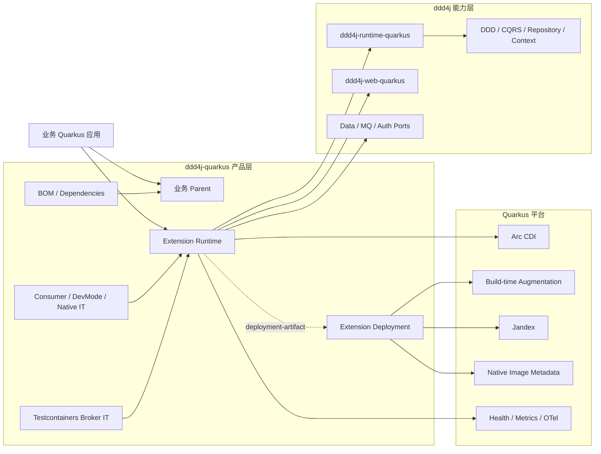
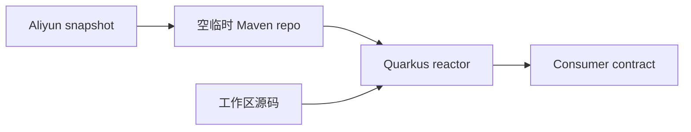
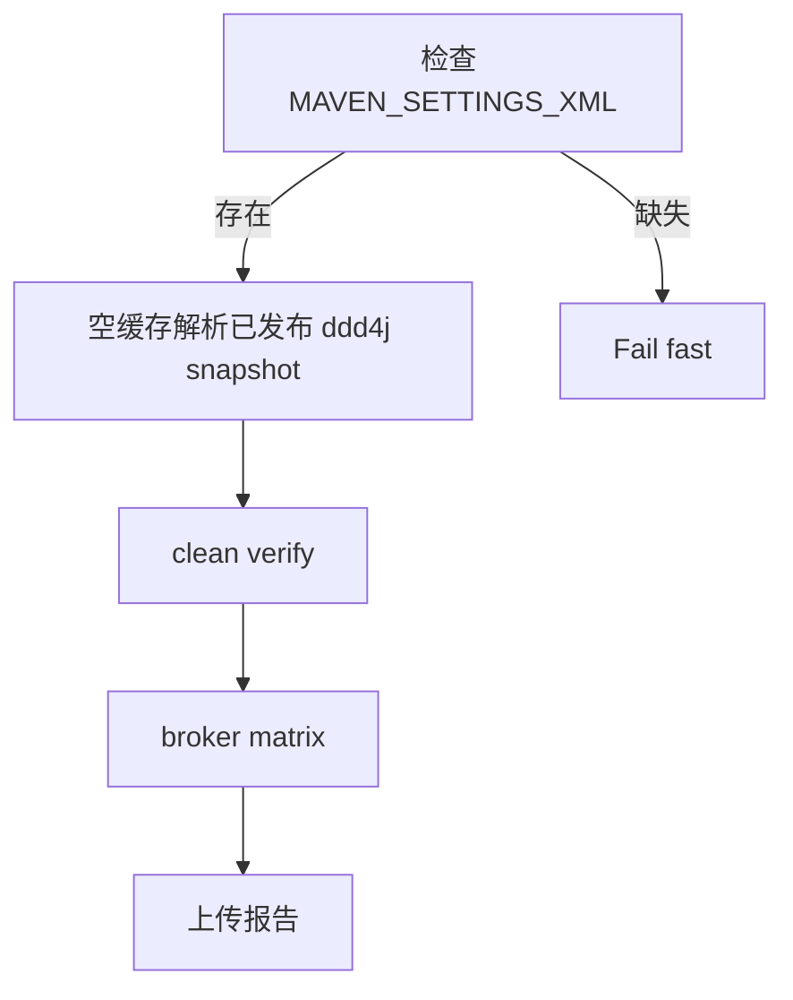

# P5 — ddd4j-quarkus 生产级扩展平台收敛设计

- 日期：2026-09-08
- 状态：P5-A 本地完成，P5-B–E 待实施
- 项目类型：Brownfield
- 规格事实源：本文档
- 参考基线：`ddd4j-boot` 的能力契约、`ddd4j feature/2.0.x` 与 `feature/3.0.x` 的框架中立实现、Quarkus 官方扩展规范
- 目标分支：先完成 `feature/4.0.x`，再移植到 `feature/3.3.x`

## 1. 背景

`ddd4j` 主仓已经承担 DDD、CQRS、Repository、EventStore、Context、SPI 生命周期、框架中立 Web/MQ/Auth/Data 契约及通用 Quarkus runtime。`ddd4j-quarkus` 不应复制这些业务语义，而应成为可被业务项目稳定消费的 Quarkus 集成产品层。

当前仓库已经具备 BOM、Dependencies、Parent、Data、MQ、Auth、Web、Extensions 和 Samples 等模块骨架，MQ/Testcontainers 及 Panache EventStore 也有真实行为测试。但源码审计发现，下列结论仍不能成立：

1. 不能把带 CDI Bean 的普通 JAR 等同于生产级 Quarkus Extension。
2. 不能把模块存在、编译成功或当前 reactor 中的 `@QuarkusTest` 成功等同于外部消费者可发现、可覆盖、可用于 Native Image。
3. 不能把 fallback、Disabled、内存替代实现或仅注入测试计入真实能力对齐。
4. 不能把本地已安装的 ddd4j snapshot 当作远程仓库可消费证据。
5. 不能把 `feature/4.0.x` 的 Testcontainers 结果外推为 `feature/3.3.x` 已完成。

## 2. 目标架构



### 2.1 所有权边界

| 层 | 拥有内容 | 不拥有内容 |
|---|---|---|
| `ddd4j` | 领域模型、SPI、Context、Repository/EventStore/MQ/Auth/Web 通用语义、通用 Quarkus runtime | ddd4j-quarkus 的 BOM、Parent、扩展描述符和消费方矩阵 |
| `ddd4j-boot` | Spring Boot 自动装配及其能力契约参考 | Quarkus 实现形态 |
| `ddd4j-quarkus` runtime | 最小运行时代码、ConfigMapping、Recorder、CDI Bean、HealthCheck | BuildStep、Jandex 扫描器、deployment 依赖 |
| `ddd4j-quarkus` deployment | BuildStep、构建期索引、反射/资源注册、capability 冲突校验 | 业务运行时 API |
| integration tests | 发布消费者、Dev Mode、Native、broker、组合冲突验证 | 生产实现 |

`ddd4j-boot` 是语义参考，不是逐类复制模板。对齐标准是：激活条件、默认值、业务覆盖、生命周期、失败语义和外部可观察行为一致。

## 3. 交付分解

本变更拆为五个独立规格与实施周期。每个阶段通过后才能进入下一阶段，不创建一次性大爆炸计划。

### P5-A：稳定 4.0.x 发布与消费基线

目标：让 `feature/4.0.x` 在不依赖开发机历史缓存、不修改 ddd4j 检出的前提下，使用已发布的 ddd4j `3.0.x.20260630-SNAPSHOT` 完成 JVM 构建、关键消费契约和 GitHub Actions。

范围：

- 审查并纳入当前未提交的版本、BOM、Web consumer 和 License E2E 候选改动。
- 统一 `revision=4.0.x.20260630-SNAPSHOT`、`ddd4j.version=3.0.x.20260630-SNAPSHOT`、Quarkus `3.38.2`、Java 21、Maven Model 4.1.0。
- BOM/Dependencies 管理 `ddd4j-runtime-quarkus`、`ddd4j-web-quarkus`、`ddd4j-extension-license`，叶模块不重复写版本。
- Web consumer 测试必须证明主仓 Filter 被外部依赖发现，并完成 tenant/request-id 闭环。
- License 测试必须在 Quarkus Bean 创建前准备真实证书，验证签发、安装和验签。
- CI 不再用 `sed` 删除 ddd4j 聚合模块。正常 PR gate 直接消费已发布 snapshot；源码兼容验证作为独立手动或定时 job，并且不得修改检出源码。
- `MAVEN_SETTINGS_XML` 缺失时 fail-fast；凭据和 settings 内容不得输出。
- Maven 4 对阿里云发布/拉取使用已验证的 Wagon transport，避免首次 metadata 404 被错误解释为致命 RFC 9457 payload。

2026-09-09 已批准补充：将 3.3.x 已评审的 Snowflake workerId 修复移植到本分支。
`ddd4j.quarkus.data.snowflake.worker-id` 为可选 Long 配置；缺省对 IP 派生值执行
`Math.floorMod(value, 32)`，显式 `0..31` 原值使用，负值或大于 31 在创建策略时拒绝，
不得对显式值取模。CDI producer 必须消费该配置；多节点部署须分配不重复的显式编号，
缺省 IP 归一化不保证跨机器唯一。验收覆盖 IP 115→19、171 的有符号 byte→11、
显式 0/31、非法 -1/32 和真实 CDI 配置生效。该补充不扩大到 P5-C 其他数据能力。
4.0.x 仍保持 Java 21、ddd4j 3.0.x、Quarkus 3.38.2、Model 4.1.0 + modules。

非目标：

- 不在 P5-A 拆 runtime/deployment 模块。
- 除已批准的共享 Snowflake workerId 修复外，不修复 Data/Auth/MQ 业务缺口。
- 不改 `feature/3.3.x`。
- 不执行 push/deploy；发布需单独授权。

验收：

1. 当前工作区候选修改逐文件审查，无用户修改被覆盖。
2. 新鲜临时 Maven 仓库可解析所有 ddd4j `3.0.x.20260630-SNAPSHOT` 必需 POM/JAR。
3. `ddd4j-quarkus-web` consumer test 的 RED 原因是主仓 Filter 未发现或上下文未传播，GREEN 时同时断言 tenant 与非空 request-id。
4. License E2E 验证 `isInstallSuccess()` 和 `verify()`。
5. `./mvnw -B clean verify -Denforcer.skip=true` 完成，并分别统计 tests/failures/errors/skipped。
6. `actionlint` 通过；CI 不包含修改 ddd4j checkout 的 `sed`。
7. GitHub Actions 在实际 push 后才能标记远端 gate 完成。

### P5-B：核心 Quarkus Extension 产品化

目标：把 core/cache/mq-core/web 改造成标准 runtime/deployment/IT 结构。

必须满足：

- runtime artifact 不得依赖任何 `quarkus-*-deployment`。
- deployment artifact 依赖对应 runtime artifact。
- runtime JAR 生成 `META-INF/quarkus-extension.properties`，其中 `deployment-artifact` 指向正确坐标。
- BuildStep、Jandex 扫描、Native metadata 位于 deployment 模块。
- ConfigMapping 与 Recorder 位于正确配置阶段。
- 每个扩展至少具备外部 consumer JVM IT；核心链增加 Dev Mode reload IT 与 Native IT。
- cache 测试必须验证 `CacheKit` 的真实行为变化，而不是只比较配置字符串和 enum 名称。

### P5-C：数据能力与 Repository 正确性

目标：修复数据适配的真实行为缺口。

必须满足：

- Repository 以聚合根类型为 key 注册，禁止使用 Repository 实现类作为 model type。
- 测试覆盖 `register(Order.class, repository)` 到 `repository(Order.class)` 的闭环及 shutdown 清理。
- data-external 提供 ExternalProperties、RegionCache、IpRegion、Pconline/Baidu/Nested、Weather、GlobalSequence 的 Quarkus 等价装配和覆盖语义。
- data-logs 实际暴露日志 provider/interceptor；若 Quarkus 不支持现有 AspectJ 激活方式，则明确采用 CDI interceptor 或删除虚假模块声明。
- datascope 使用可覆盖的默认 Bean，并测试默认、disabled、custom override。
- Panache EventStore 与主仓确定唯一实现所有权，不保留两套可漂移语义。

### P5-D：Auth、MQ 与运行时治理

目标：把静态 SPI、认证选择、MQ 启停和健康状态收敛为单一生命周期。

必须满足：

- 只有主运行时协调者可以写入和恢复 `SubjectKit`、`I18nKit` 与 BaseContext SPI。
- Auth 模块只生产候选 `SubjectProvider`，并声明互斥 capability；同时选择多个 Auth 实现时构建失败并给出可操作错误。
- 默认 Bean 可被业务实现覆盖，不要求用户通过模糊的 CDI 优先级消除歧义。
- MQ 增加 `required` 语义：required 模式初始化失败则启动失败；optional 模式启动但 readiness DOWN。
- MQ 初始化、监听器数量、broker、失败原因进入 Health/Metric/OTel。
- MQ shutdown 清理 listener/client，Dev Mode reload 不重复注册。
- 使用 Jandex 构建期发现 `@MQEventListener`，不把全量运行时反射注册责任推给业务方。

### P5-E：双分支、Native 与发布闭环

目标：把已验证能力移植到 Java 17 维护线，并形成可发布证据。

必须满足：

- `feature/3.3.x`：ddd4j 2.0.x、Quarkus 3.37.4、Java 17、Maven Model 4.0.0、`modules/module`、Testcontainers 2.0.5。
- `feature/4.0.x`：ddd4j 3.0.x、Quarkus 3.38.2、Java 21、Maven Model 4.1.0；`subprojects/subproject` 等待 Quarkus WorkspaceLoader 上游修复。
- 修复 Java 17 分支的 zxing artifact 字节码线，禁止用 Java 21 构件冒充 2.0.x。
- 两分支分别执行 JVM、consumer、broker、Dev Mode、Native 关键路径。
- publication 必须从新鲜仓库回拉验证，不以 deploy exit code单独作为完成证据。
- 本地、origin、github、Maven snapshot 的版本与 SHA/时间戳分别报告。

## 4. P5-A 详细设计

### 4.1 当前未提交修改处理

下列文件属于用户批准“保留、审查后纳入”的候选基线：

- `pom.xml`
- `ddd4j-quarkus-bom/pom.xml`
- `ddd4j-quarkus-dependencies/pom.xml`
- `ddd4j-quarkus-web/pom.xml`
- `ddd4j-quarkus-auth/ddd4j-quarkus-auth-license/pom.xml`
- `ddd4j-quarkus-auth/ddd4j-quarkus-auth-license/src/test/java/io/ddd4j/quarkus/auth/license/LicenseEnabledEndToEndQuarkusTest.java`
- `ddd4j-quarkus-web/src/test/java/io/ddd4j/quarkus/web/Ddd4jQuarkusWebConsumerTest.java`
- `ddd4j-quarkus-web/src/test/java/io/ddd4j/quarkus/web/Ddd4jQuarkusWebContractResource.java`

原有 MQTT 随机持久化目录不属于本变更，不删除、不修改、不提交。

审查规则：

1. 先保留现状并运行目标测试，不从 Git 恢复或覆盖。
2. 每项改动必须对应一个可观察失败或消费契约。
3. 不以“去掉显式版本”作为目标；只有 BOM 已提供准确坐标时才删除叶模块版本。
4. 如果候选改动与规格冲突，使用最小补丁调整，不回滚整个文件。

### 4.2 版本与仓库模型

P5-A 的唯一有效版本矩阵：

| 项目 | 值 |
|---|---|
| ddd4j-quarkus revision | `4.0.x.20260630-SNAPSHOT` |
| ddd4j | `3.0.x.20260630-SNAPSHOT` |
| Quarkus BOM/plugin | `3.38.2` |
| Testcontainers | `2.0.5` |
| Java | 21 |
| Maven | 4.0.0-rc-6 |
| Model | 4.1.0 |
| 聚合 | 临时 `modules/module`，等待 Quarkus 上游修复 |

依赖解析分三层验证：



- 源码层：检查 POM 声明和 dependencyManagement 顺序。
- 仓库层：使用空临时 repo 获取 ddd4j 父 POM、BOM、runtime/web/license 及关键 JAR。
- 消费层：在 Quarkus 启动后验证主仓 Bean/Filter 的真实效果。

### 4.3 Web consumer 契约

请求：

```text
GET /ddd4j/contract
X-Tenant-Id: tenant-consumer
```

必须观察：

- HTTP 200。
- `X-Request-Id` 响应头存在且非空。
- 响应 JSON 的 `tenantId` 等于 `tenant-consumer`。
- 请求完成后线程上下文清理，后续无 tenant header 的请求不能继承前一次 tenant。

最后一项防止只验证“写入”而遗漏“释放”。

### 4.4 License 契约

测试 profile 必须在 Quarkus 创建 `LicenseVerify` Bean 前：

1. 清理专用临时目录。
2. 生成公私钥库。
3. 签发 30 天有效测试许可证。
4. 注入固定且仅测试使用的路径和密码。
5. 断言 Bean 可解析、安装成功、验签成功。

所有文件必须位于 `java.io.tmpdir` 下，不写仓库目录。失败信息不得包含密钥材料。

### 4.5 CI

PR/Push 主 gate：



约束：

- workflow 中不修改 ddd4j checkout。
- workflow-lint 必须真正执行 actionlint，不保留 echo 占位。
- broker matrix 保持 blocking，允许 `fail-fast: false` 以收集全部失败。
- 每个失败 job 上传 Surefire/Failsafe 和关键容器日志。
- Maven settings 只写权限 0600 的临时文件；日志只输出是否存在和 HTTP 状态，不输出凭据。

## 5. 横切质量门禁

所有阶段共同遵循：

1. TDD：先形成目标行为 RED，再做最小实现并验证 GREEN。
2. Backoff：每个默认 Bean 都测试业务自定义 Bean 优先。
3. Disabled：跳过项必须方法级、写明环境或商业服务原因，并单独统计。
4. Native：运行时反射、资源、ServiceLoader 和动态类加载必须由 deployment 模块显式治理。
5. 生命周期：启动、失败回滚、关闭、Dev Mode reload 均不得泄漏全局 SPI 或线程上下文。
6. 可观测性：健康检查不得恒定 UP；外部依赖状态应由 contributor 聚合。
7. 发布：区分源码、测试、构建、deploy、远程下载、业务验收六层证据。
8. Git：不使用 worktree，不覆盖用户脏文件，不把 MQTT 随机目录加入提交。

## 6. 文档真实度

`docs/CAPABILITY-ALIGNMENT.md` 中的状态改为：

- `已验证`：存在实现、行为测试、外部 consumer 或对应运行模式证据。
- `部分完成`：只完成 CDI/配置/局部行为。
- `占位`：只有 POM、描述或 fallback。
- `未验证`：实现存在，但没有目标运行模式证据。
- `上游阻塞`：外部框架问题有可复现证据。

禁止继续使用一个“✅ 已对齐”覆盖多个能力维度。

## 7. 风险与回滚

| 风险 | 控制方式 |
|---|---|
| 当前脏文件与实施重叠 | 逐文件最小补丁；提交前列出精确文件 |
| runtime/deployment 拆分破坏坐标 | runtime artifactId 保持消费者坐标；新增 `-deployment` artifact |
| 多 Auth Bean 导致 CDI 歧义 | deployment capability 冲突校验 + 独立组合测试 |
| MQ fail-fast 影响现有 optional 用户 | 新增显式 required 配置，默认保持兼容，readiness 反映降级 |
| 主仓/Quarkus EventStore 双实现漂移 | 先确定唯一所有权，再删除重复；行为契约先锁定 |
| Maven 4/Quarkus WorkspaceLoader 阻塞 | 保持 Model 4.1.0 + modules 临时基线，不虚报 subprojects 完成 |
| 发布产物依赖缺失 | 空 repo 消费门禁早于 deploy，并在 deploy 后重复验证 |

任何阶段失败均回滚到上一阶段已验证提交；不通过跳过测试、扩大 Disabled 或依赖本地缓存获得绿灯。

## 8. 完成定义

只有以下条件全部满足，才能称 `ddd4j-quarkus` 完成生产级优化：

- P5-A 至 P5-E 分别具有已批准规格、实施计划和完成证据。
- 核心扩展采用标准 runtime/deployment/IT 结构。
- 外部消费者可发现所有声明能力。
- Repository、Auth、MQ、Data 的关键行为闭环通过。
- JVM、Dev Mode、Native、broker matrix 均有新鲜证据。
- 3.3.x 与 4.0.x 均通过其版本/JDK/Maven/Testcontainers 门禁。
- 两个 Git 远端与 Maven snapshot 分别核对成功。
- `subprojects` 在上游未修复前保持“上游阻塞”，不影响其他阶段完成，但不标记为已实现。

## 9. P5-A 本地完成证据（2026-09-09）

本轮在 `feature/4.0.x`、代码基线 `278f119` 上执行 P5-A Task 5 Steps 1–5，全部本地门禁通过。
版本矩阵已从 POM 与 `./mvnw --version` 核对：revision `4.0.x.20260630-SNAPSHOT`、
ddd4j `3.0.x.20260630-SNAPSHOT`、Quarkus `3.38.2`、Testcontainers `2.0.5`、
Java `21.0.12.1`、Maven `4.0.0-rc-6`、Model `4.1.0` + `modules/module`。

| 门禁 | 实际命令或检查 | 观察结果 |
|---|---|---|
| 新空仓远端消费 | `./mvnw -B -U -f .github/maven/ddd4j-remote-consumer/pom.xml -Dmaven.repo.local=/tmp/ddd4j-p5a-final.xcqRbQ -Dmaven.resolver.transport=wagon dependency:go-offline` | exit 0，BUILD SUCCESS，1:39；目录由本轮 mktemp 新建 |
| Web | `./mvnw -B -Denforcer.skip=true -pl ddd4j-quarkus-web -am test` | exit 0，4 tests，0 failures/errors/skips，8.307 秒 |
| License | `./mvnw -B -Denforcer.skip=true -pl ddd4j-quarkus-auth/ddd4j-quarkus-auth-license -am test` | exit 0，3 tests，0 failures/errors/skips，8.147 秒 |
| 完整 JVM reactor | `./mvnw -B clean verify -Denforcer.skip=true` | exit 0，62/62 模块 SUCCESS，9:57；02:09:38 +08:00 完成 |
| XML 汇总 | 遍历 `**/target/{surefire,failsafe}-reports/TEST-*.xml` 并累加 suite 属性 | 47 suites、141 tests、0 failures、0 errors、3 skipped；全部 Surefire，0 Failsafe suites |
| Workflow | `actionlint .github/workflows/ci.yml` | exit 0 |
| 过期配置/源码改写 | 扫描指定 POM 与 `.github` 的过期 snapshot、旧 action、`sed -i`、lint 占位 | 无命中 |
| Maven 聚合 | 指定 6 个 POM 的文本扫描及 XML 解析 | 文本仅命中根 POM:47 的说明注释；实际 subprojects/subproject 元素为 0 |
| 文档格式 | `git diff --check` | exit 0 |

新仓含 runtime-quarkus、web-quarkus、extension-license 的 POM/JAR 时间戳
`3.0.x.20260630-20260908.152610-5`，dependencies BOM 为
`3.0.x.20260630-20260908.152610-10`。这证明已发布上游依赖闭包可回拉；
完整 reactor 使用本机配置的 Maven 仓库，没有使用该新仓 override，不能称整仓空缓存构建。

Web 除 tenant 与非空 request-id，还通过同服务线程的响应后探针断言 tenant-id、request-id、
Authorization 已清理。License 在 CDI 创建前完成真实签发，断言 `isInstallSuccess()` 与
`verify()`，并检查每次运行独立临时目录及 POSIX 权限；退出清理由测试资源生命周期管理。

三项 skip 均保留在 141 tests 内：

| 测试类（包均以 `io.ddd4j.quarkus.` 开头） | 方法 | XML 原因 |
|---|---|---|
| `mq.mqttmica.MicaMqttQuarkusIntegrationTest` | `shouldPublishAndConsumeOrderCreatedEventEndToEnd` | mica-mqtt AIO 在 macOS arm64 的已知缺陷，对齐 javalin Ddd4jMicaMqttMqIT 先例；CI linux 可移除 |
| `mq.ons.OnsQuarkusIntegrationTest` | `shouldPublishAndConsumeOrderCreatedEventEndToEnd` | ONS 商业协议无 Testcontainers 镜像，对齐 javalin Ddd4jOnsMqIT 先例 |
| `auth.security.SecurityQuarkusConfigTest` | `subjectProviderExposedAsCdiBeanAndRegisteredInSubjectKit` | Module is deprecated since 4.1.0; see docs/MIGRATION-auth-security-to-satoken.md |

TDMQ 的测试内存 fallback 不属于 skip，但不能计为腾讯云服务验收。
本轮仍观察到上游 effective-model 警告、release 仓 metadata 的缓存 RFC9457 transfer 警告、
Quarkus 读取 Maven wrapper settings 时的 `repositories` 解析警告、只读 `resources` 参数警告，
以及 datasource/Flyway/Hibernate 测试配置未识别提示。它们未阻断此次命令，但未在 P5-A 修复。
`-Denforcer.skip=true` 表示 Enforcer 没有作为通过门禁。

CI 已改为配置 Maven settings、空仓消费已发布 ddd4j、实际执行 actionlint，
并保留阻塞性 13 broker matrix；不再检出安装或修改 ddd4j 源码。settings 经临时文件校验后
以 0600 权限原子替换。上述为本地源码/验证证据，本轮没有 push/deploy、tag 或 GitHub Actions
运行证据，组织 secret 的实际 hosted 可用性尚未验证。

P5-B–E、runtime/deployment/IT 产品化、Native、Dev Mode、3.3.x 和生产验收仍待实施/验证。
Maven 4 `subprojects` 保留上游阻塞状态；本轮只确认没有引入这些标签，未重新测试上游修复。
